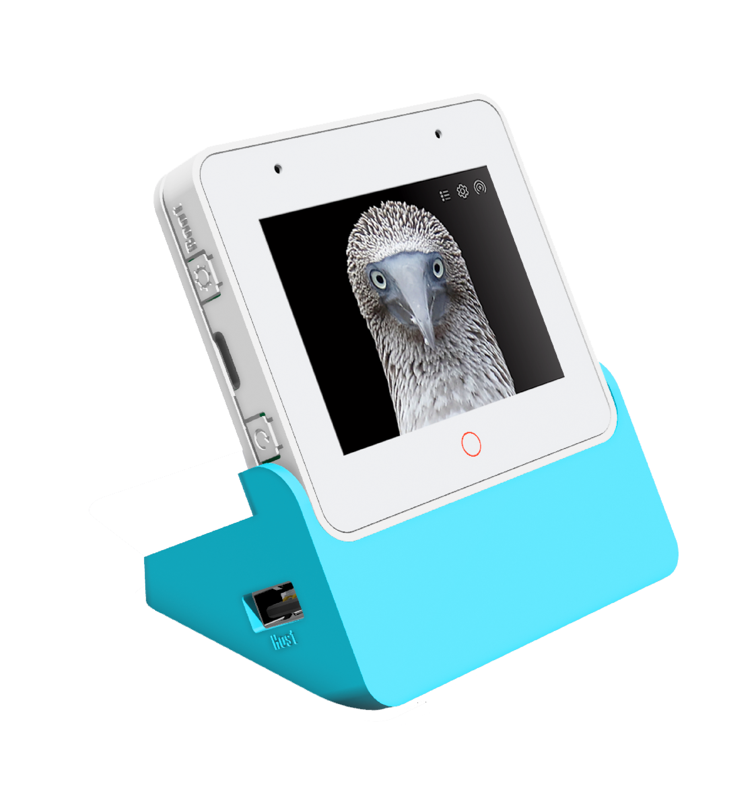

# **ESP32S3-BOX3**

[ "")](https://github.com/sponsors/QuackHack-McBlindy)

Bare Metal *(no_std)* **ESP32S3-BOX3** project written in Rust.   




<details><summary><strong>
Usage:
</strong></summary>


> [!CAUTION]
> __Code is under active development!__ <br>
> **It may not behave is expected.** 
<br>

You can build and flash your ESP32-S3-BOX-3 using `micro-deploy`:  

```bash
nix run github:QUackHack-McBlindy/micro-deploy -- \
  https://github.com/QUackHack-McBlindy/ESP32-S3-BOX-3-rs \
  ~/wifi.env \
  /dev/ttyACM0
```

*Setting up the enviorment and building may take a while..*


</details>


### **Roadmap**

- ✅ Async 
- ✅ WIFI
- ❌ Over The Air firmware updates
- ✅ Sensors
- ❌ Battery Sensor
- ✅ Display
- ❌ Touch
- ❌ Voice Assistant functionality (I2S)
- ❌ Internal HTTP API (+ basic frontend?)
- ✅ Backend

<br>

### **📶 Specs**

- Main Module: ESP32-S3-WROOM-1
- SoC: ESP32-S3 (dual-core Xtensa LX7 240 MHz)
- Memory: SRAM 512 KB internal, 16 MB QSPI Flash, 16 MB Octal PSRAM @80MHz

### **🔋 PMU (AXP2101)**

- Rechargable 18650 Battery *(note: O=11mm)*
- Messure battery procentage on ADC1 by dividing battery voltage with 4.11 

### **🖥️ Display (ILI9341)**

- SPI
- Backlight output GPIO: 47 (LEDC)
- 2.4" LCD
- 320x240

### **👉 Touch (GT911)**

- GPIO 3
- Adress: `0x5D`
- i2c bus a
- Captive Touch

### **📢 Amplifier (NS4150)**

- Digital Output GPIO: 15 (I2S output) 
- 16-bit, 48 kHz sample rate
- built-in 8Ω/1W speaker 
- Channel Left

### **🎙️ Microphone (ES7210)**

- Digital Input GPIO: 16 (I2S input) 
- Dual digital microphones
- Audio Codec (ES8311)
- 16-bit, 16 kHz sample rate

### **🕵️ Motion Sensor (...?)**

- Occupancy (Radar) at GPIO 21  


### **🌡️ Temperature Sensor (AHT20)**

- Humidity Sensor

### **📡 Infrared (IR)**

- Transmitter (...)
- Receiver (IRM-H638T ?)


### **🧩 Extensions** 

- ESP32-S3-BOX-3-DOCK
- ESP32-S3-BOX-3-SENSOR
- ESP32-S3-BOX-3-BRACKET
- ESP32-S3-BOX-3-BREAD: PCIe to 2.54mm headers 
- 2x headers (16 GPIOs, 3.3V)
- SD card slot (up to 32gb)
- USB A

### **⭕ Buttons**

- Top Left (GPIO 0)
- Reset
- Boot
- Mute (GPIO 46)

### **I2C**

**Bus A**
- 100kHz
- sda: GPIO 08 (pullup_enabled)
- scl: GPIO 18 (pullup_enabled)

**Bus B**
- 50kHz
- sda: GPIO 41 (pullup_enabled)
- scl: GPIO 40 (pullup_enabled)


### **i2S**

- lrclk_pin: GPIO45 (ignore_strapping_warning)  
- bclk_pin: GPIO17
- mclk_pin: GPIO2

### **Audio ADC (es7210)**

- I2C Bus A
- 16bit, 16000 sample rate

### **Audio DAC (es8311)**

- I2C Bus A
- 16bit, 48000 sample rate


<br>

## **🪑 Table**

| Component              | Interface       | Pin(s) / Address          | Notes                                                                 |
|------------------------|-----------------|---------------------------|-----------------------------------------------------------------------|
| **ESP32-S3**           | -               | -                         | Main microcontroller, 16MB flash, octal PSRAM @80MHz                 |
| **Display (LCD)**      | SPI             | CLK=GPIO7, MOSI=GPIO6     | ILI9xxx driver, model `S3BOX` (ILI9341 compatible)                   |
|                        |                 | CS=GPIO5, DC=GPIO4        |                                                                       |
|                        |                 | Reset=GPIO48 (inverted)   |                                                                       |
| **Backlight**          | PWM (LEDC)      | GPIO47                    |                                       |
| **Touchscreen**        | I²C (bus A)     | SDA=GPIO8, SCL=GPIO18     | GT911 controller, address `0x5D`                                     |
|                        |                 | Interrupt=GPIO3           |                                                                       |
| **I2S Audio Bus**      | I2S             | BCLK=GPIO17, LRCLK=GPIO45 | Shared between microphone and speaker                                |
|                        |                 | MCLK=GPIO2                | Master clock for audio codecs                                        |
| **Microphone**         | I2S (input)     | DIN=GPIO16                | ES7210 ADC, I²C controlled (bus A)                                   |
| **Speaker**            | I2S (output)    | DOUT=GPIO15               | ES8311 DAC, I²C controlled (bus A)                                   |
| **Audio ADC (ES7210)** | I²C (bus A)     | Address `0x40`? (default) | Microphone front-end, 16-bit, 16 kHz sample rate                     |
| **Audio DAC (ES8311)** | I²C (bus A)     | Address `0x18`? (default) | Speaker amplifier, 16-bit, 48 kHz sample rate                        |
| **Physical Button**    | GPIO input      | GPIO0                     | Top‑left button, internal pull‑up, inverted                          |
| **Radar Presence**     | GPIO input      | GPIO21                    | Occupancy sensor (HLK-LD2410 ?)                                  |
| **Speaker Enable**     | GPIO output     | GPIO46                    | Switch to enable/disable external speaker amp                        |
| **Temperature/Humidity**| I²C (bus B)    | SDA=GPIO41, SCL=GPIO40    | AHT20 sensor, address `0x38` (default)                               |
| **Battery Voltage**    | ADC1            | GPIO10                    | Measures battery voltage via voltage divider (multiply by 4.11)      |
| **I²C Bus A**          | I²C             | SDA=GPIO8, SCL=GPIO18     | 100 kHz, pull‑ups enabled – connects touch, ES7210, ES8311           |
| **I²C Bus B**          | I²C             | SDA=GPIO41, SCL=GPIO40    | 50 kHz, pull‑ups enabled – connects AHT20 sensor                     |
| **USB‑Serial‑JTAG**    | USB             | -                         | Built‑in, used for logging        |
| **PSRAM**              | -               | -                         | Octal PSRAM, 8 MB                    |
| **WiFi/Bluetooth**     | -               | -                         | Integrated                                          |


<br>

### **License**

<br>

**MIT**

