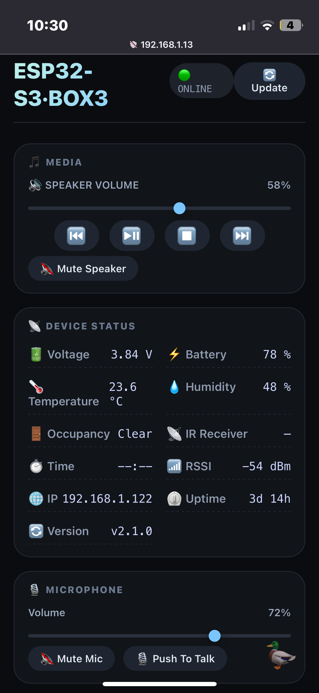

# **ESP32-S3-BOX-3-rs**

[ "")](https://github.com/sponsors/QuackHack-McBlindy) [](https://buymeacoffee.com/quackhackmcblindy)


Bare Metal *(no_std)* **ESP32-S3-BOX-3** firmware written in Rust (no `esp-idf`).   
Designed to be used as a voice assistant and/or smart speaker.   
  
> [!CAUTION]
> __Project is under active development!__ <br>
> **Breaking changes will be frequent.**  
<br>


### **Roadmap**

- [x] Async & WiFi
- [x] Buttons & Display (lights up on wake word detection)
- [x] Sensors (presence, temperature, humidity, battery status, ...)
- [x] i2s: RX (Microphone) **FEATURE:** `use_mic` *(default)*
- [x] i2s: TX (Speaker) **FEATURE:** `use_speaker`
- [ ] ⚠️ i2s: Simultaneous RX & TX 
- [x] Voice Command Execution (Wake word, speech to shell command)
- [x] On-Device API
- [x] On-Device WebServer (UI frontend)
- [ ] OTA (auto update from git repo)
- [ ] InfraRed (Send & Recieve)
- [ ] Touch UI (settings, clock, media player, TV remote)
- [ ] Security & WireGuard
- [x] Backend: `yo`

`yo` is not only the backend server service but it's also where you will write your voice commands.  
This is where your `ESP32-S3-BOX-3` microphone audio will be stream  

- [yo](https://github.com/QuackHack-McBlindy/yo)  
  - Wake Word Detection
  - Speech To Text
  - Text To Speech
  - Voice Command Execution


<br>


## **Installation**

<details><summary><strong>
❄️ Using flakes (TODO)
</strong></summary>

*not yet...*

</details>


<details><summary><strong>
📦 Building from source
</strong></summary>


Configure WiFi and other required seetings in the example `.env` file.  

```bash
$ mv .env.example .env
$ nano .env
```


## **Build and flash!**

```bash
cargo run --release
```


</details>


<details><summary><strong>
🐋 Docker (recommended)
</strong></summary>

```bash
$ git clone https://github.com/QuackHack-McBlindy/ESP32-S3-BOX-3-rs
$ cd ESP32-S3-BOX-3-rs
```

Configure WiFi and other required seetings in the example `.env` file.  

```bash
$ mv .env.example .env
$ nano .env
```

`docker-compose.yaml` may require you to change the defined serial port.  
To locate the serial port for use with the `docker-compose.yaml` file you can run the following command:  

```bash
$ ls -l /dev/serial/by-id/
```

**Build and Flash!**

```bash
$ docker compose build
$ docker compose up
```


</details>


<br><br>

## **Flashed - now What?**


#### **Visit Your Device**  



**Web UI**  

Open your browser: `http://<esp-ip>:80`  
*(You will see your device ip in the terminal after flashing)*  

Here you can control and fully utilize all components of the ESP32-S3-BOX-3 from your browser.     
Logs will be at: `http://<esp-ip>:80/logs`  
    
  

#### **API**

The API is designed to be easily expandable, it will most likely grow, best to check [src/api.rs](https://github.com/QuackHack-McBlindy/ESP32-S3-BOX-3-rs/blob/main/src/api.rs) for supported endpoints.    
*or try fetch your available endpoints at:* `curl http://<esp-ip>:80/api`   
  
  
Using the internal API you can for example set the `ESP32-S3-BOX-3` display brightness *(LEDC)* tp 75 percentae using:    


```bash
curl http://<esp-ip>:80/api/settings/display/brightness/75 
```
  

| Endpoint | Description |
|----------|-------------|
| `/` | Serves the web frontend (HTML dashboard) |
| `/favicon.ico` | Serves the favicon (currently returns 404) |
| `/script.js` | Serves the JavaScript frontend logic |
| `/api` | Returns a plain‑text list of all available API endpoints |
| `/api/update` | Trigger OTA firmware update |
| `/api/settings/power/state/{value}` | Control device power: `on`, `off`, or `toggle` (default) |
| `/api/settings/display/state/{value}` | Control display on/off: `on`, `off`, or `toggle` |
| `/api/settings/display/brightness/{value}` | Set backlight brightness (0–80%). `{value}` as integer percent |
| `/api/settings/mic/volume/{value}` | Set microphone gain (0–100%). Returns current volume |
| `/api/settings/mic/mute/{value}` | Mute/unmute mic: `1`/`on`/`mute`, `0`/`off`/`unmute`, or `toggle` |
| `/api/settings/speaker/volume/{value}` | Set speaker volume (0–100%) |
| `/api/settings/speaker/mute/{value}` | Mute/unmute speaker: same options as mic mute |
| `/api/settings/voice/state/{value}` | Voice recording command: `start` or `stop` |
| `/api/voice/detected` | Called when voice is detected; sets brightness to 70% and returns `"OK"` |
| `/api/voice/executed` | Called after a voice command succeeds; sets brightness to 0% and returns `"OK"` |
| `/api/voice/failed` | Called after a voice command fails; sets brightness to 0% and returns `"OK"` |
| `/api/media/{action}` | Media control (e.g., `play`, `pause`, `next`, `prev`) |
| `/api/sensor/{value}` | Read a sensor or system value (see supported keys below) |

### Supported sensor keys for `/api/sensor/{value}`

| Key | Description |
|-----|-------------|
| `temp`, `temperature` | Temperature in °C (e.g., `23.6`) |
| `hum`, `humidity` | Relative humidity in % (e.g., `48`) |
| `battery`, `battery_level`, `battery_percentage` | Battery charge % (e.g., `78`) |
| `battery_voltage`, `voltage` | Battery voltage in V (e.g., `3.84`) |
| `occupancy`, `motion`, `presence` | Occupancy state (`Clear` / `Detected`) |
| `rssi`, `wifi_signal`, `wifi` | Wi‑Fi signal strength in dBm (e.g., `-54`) |
| `ip` | Device IP address (e.g., `192.168.1.122`) |
| `uptime` | System uptime (e.g., `3d 14h`) |
| `firmware`, `version` | Firmware version string (e.g., `v2.1.0`) |


<br><br>


# **HARDWARE**


### **📶 Specs**

- Main Module: ESP32-S3-WROOM-1
- SoC: ESP32-S3 (dual-core Xtensa LX7 240 MHz)
- Memory: SRAM 512 KB internal, 16 MB QSPI Flash, 16 MB Octal PSRAM @80MHz

### **🔋 PMU (AXP2101)**

- Rechargable 18650 Battery *(note: O=11mm)*
- Messure battery procentage on ADC1 by dividing battery voltage with 4.11 

### **🖥️ Display (ILI9341)**

- SPI
- Interface speed: 40 MHz
- Backlight output GPIO: 47 (LEDC)
- 2.4" LCD
- 320x240

### **👉 Touch (GT911)**

- GPIO 3
- Adress: `0x5D`
- i2c bus a
- 10 Point Captive Touch

### **📢 Amplifier (NS4150)**

- Digital Output GPIO: 15 (I2S output) 
- 16-bit, 48 kHz sample rate
- built-in 8Ω/1W speaker (NS4150)
- Audio Codec (ES8311)
- Channel Left

### **🎙️ Microphone (ES7210)**

- Digital Input GPIO: 16 (I2S input) 
- Dual digital microphones
- Audio Codec (ES7210)
- 16-bit, 16 kHz sample rate

### **🕵️ Presence Sensor (MS58-3909S68U4)**

- Radar at GPIO: 21  
- Frequency band: 5.8 GHz
- 2 meter range

### **🌡️ Temperature Sensor (AHT20)**

- Temperature Sensor
- Humidity Sensor

### **🧭 Gyroscope (ICM-42607-P)**

- 3-axis Gyroscope
- 3-axis Accelerometer 


### **📡 Infrared (IR)**

- Emitter (IRM-H638T)
- Receiver (IR-6721C/TR8) 


### **🧩 Extensions** 

- ESP32-S3-BOX-3-DOCK
- ESP32-S3-BOX-3-SENSOR
- ESP32-S3-BOX-3-BRACKET
- ESP32-S3-BOX-3-BREAD: PCIe to 2.54mm headers 
- 2x headers (16 GPIOs, 3.3V)
- SD card slot (up to 32gb)
- USB A

### **⭕ Buttons**

- Top Left (GPIO 0)
- Reset
- Boot
- Mute (GPIO 46)

### **I2C**

**Bus A**
- 100kHz
- sda: GPIO 08 (pullup_enabled)
- scl: GPIO 18 (pullup_enabled)

**Bus B**
- 50kHz
- sda: GPIO 41 (pullup_enabled)
- scl: GPIO 40 (pullup_enabled)


### **i2S**

- lrclk_pin: GPIO45 (ignore_strapping_warning)  
- bclk_pin: GPIO17
- mclk_pin: GPIO2

### **Audio ADC (es7210)**

- I2C Bus A
- 16bit, 16000 sample rate

### **Audio DAC (es8311)**

- I2C Bus A
- 16bit, 48000 sample rate


<br>

## **🪑 Table**

| Component              | Interface       | Pin(s) / Address          | Notes                                                                 |
|------------------------|-----------------|---------------------------|-----------------------------------------------------------------------|
| **ESP32-S3**           | -               | -                         | Main microcontroller, 16MB flash, octal PSRAM @80MHz                 |
| **Display (LCD)**      | SPI             | CLK=GPIO7, MOSI=GPIO6     | ILI9xxx driver, model `S3BOX` (ILI9341 compatible)                   |
|                        |                 | CS=GPIO5, DC=GPIO4        |                                                                       |
|                        |                 | Reset=GPIO48 (inverted)   |                                                                       |
| **Backlight**          | PWM (LEDC)      | GPIO47                    |                                       |
| **Touchscreen**        | I²C (bus A)     | SDA=GPIO8, SCL=GPIO18     | GT911 controller, address `0x5D`                                     |
|                        |                 | Interrupt=GPIO3           |                                                                       |
| **I2S Audio Bus**      | I2S             | BCLK=GPIO17, LRCLK=GPIO45 | Shared between microphone and speaker                                |
|                        |                 | MCLK=GPIO2                | Master clock for audio codecs                                        |
| **Microphone**         | I2S (input)     | DIN=GPIO16                | ES7210 ADC, I²C controlled (bus A)                                   |
| **Speaker**            | I2S (output)    | DOUT=GPIO15               | ES8311 DAC, I²C controlled (bus A)                                   |
| **Audio ADC (ES7210)** | I²C (bus A)     | Address `0x40`? (default) | Microphone front-end, 16-bit, 16 kHz sample rate                     |
| **Audio DAC (ES8311)** | I²C (bus A)     | Address `0x18`? (default) | Speaker amplifier, 16-bit, 48 kHz sample rate                        |
| **Physical Button**    | GPIO input      | GPIO0                     | Top‑left button, internal pull‑up, inverted                          |
| **Radar Presence**     | GPIO input      | GPIO21                    | Occupancy sensor (HLK-LD2410 ?)                                  |
| **Speaker Enable**     | GPIO output     | GPIO46                    | Switch to enable/disable external speaker amp                        |
| **Temperature/Humidity**| I²C (bus B)    | SDA=GPIO41, SCL=GPIO40    | AHT20 sensor, address `0x38` (default)                               |
| **Battery Voltage**    | ADC1            | GPIO10                    | Measures battery voltage via voltage divider (multiply by 4.11)      |
| **I²C Bus A**          | I²C             | SDA=GPIO8, SCL=GPIO18     | 100 kHz, pull‑ups enabled – connects touch, ES7210, ES8311           |
| **I²C Bus B**          | I²C             | SDA=GPIO41, SCL=GPIO40    | 50 kHz, pull‑ups enabled – connects AHT20 sensor                     |
| **USB‑Serial‑JTAG**    | USB             | -                         | Built‑in, used for logging        |
| **PSRAM**              | -               | -                         | Octal PSRAM, 8 MB                    |
| **WiFi/Bluetooth**     | -               | -                         | Integrated                                          |


<br>


<br><br>


## **☕**

[ "")](https://github.com/sponsors/QuackHack-McBlindy) [](https://buymeacoffee.com/quackhackmcblindy)
> 🦆🧑‍🦯 says ⮞ Hi! I'm QuackHack-McBlindy!  
> 🦆🧑‍🦯 says ⮞ Like my work?  
> Buy me a coffee, or become a sponsor.  
> Thanks for supporting open source/hungry developers ♥️🦆!   

♥️₿ *Donate crypto? Wallet:* `pungkula.x`  
<a href="https://www.buymeacoffee.com/quackhackmcblindy" target="_blank"></a>


<br>

## **License**

**MIT**  
