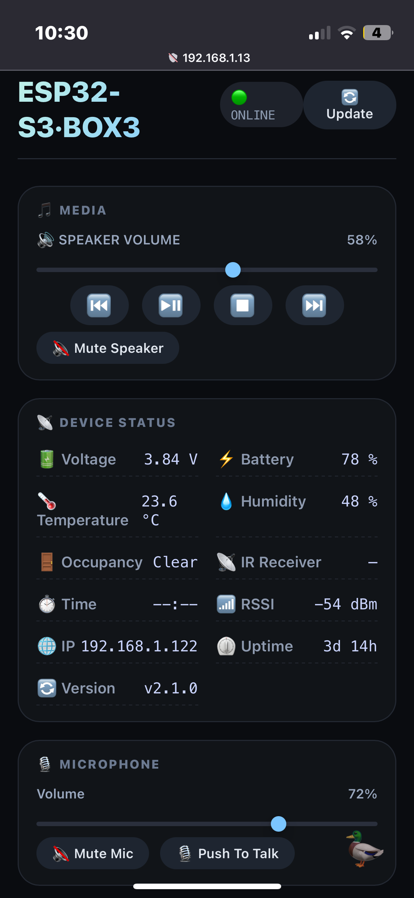

# **ESP32-S3-BOX-3-rs**

[ "")](https://github.com/sponsors/QuackHack-McBlindy) [](https://buymeacoffee.com/quackhackmcblindy)


Bare Metal *(no_std)* `ESP32-S3-BOX-3` firmware written in Rust (no `esp-idf`).   
Designed to be used as a voice assistant and smart speaker.  
Run this with a tiny GGML model (raise fuzzy matching level) and it will be **instant!**.  

  
> [!NOTE]
> __🎵 Media Player__ <br>
> **Media player supports any file format, and can play any file or playlist.**  
> **You can use the provided `play-esp.sh` helper script to stream audioo to the device speaker.**
<br>


https://github.com/user-attachments/assets/f0ece35f-b094-4a7a-9258-403cbdb0cf57


### **Roadmap**

- [x] Async & WiFi
- [x] Buttons & Display (lights up on wake word detection)
- [x] Sensors (presence, temperature, humidity, battery status, ...)
- [x] i2s: RX Microphone  
- [x] i2s: TX Speaker  
- [x] i2s: Simultaneous RX & TX 
- [x] Voice Command Execution (Wake word, speech to shell command)
- [x] Media Player - Stream any audio to speaker (wav, mp3, flac, mp4, ...)
- [x] Intercom `ffmpeg -f alsa -i default -f s16le -ar 16000 -ac 2 - | nc <ESP_IP> 12345`
- [x] On-Device API
- [x] On-Device WebServer (UI frontend)
- [ ] OTA (auto update from git repo?)
- [ ] InfraRed (Send & Recieve)
- [ ] Touch UI (settings, clock, media player, TV remote)
- [ ] Security & WireGuard?
- [x] Backend: `yo`

`yo` is not only the backend server service but it's also where you will write your voice commands.  
This is where your `ESP32-S3-BOX-3` microphone audio will be streamed.   

- [yo](https://github.com/QuackHack-McBlindy/yo)  
  - Wake Word Detection
  - Speech To Text
  - Text To Speech
  - Voice Command Execution


<br>


## **Installation**

<details><summary><strong>
❄️ Using flakes (TODO)
</strong></summary>

*not yet...*

</details>


<details><summary><strong>
📦 Building from source
</strong></summary>


Configure WiFi and other required seetings in the example `.env` file.  

```bash
$ mv .env.example .env
$ nano .env
```


## **Build and flash!**

```bash
cargo run --release
```


</details>


<details><summary><strong>
🐋 Docker (recommended)
</strong></summary>

```bash
$ git clone https://github.com/QuackHack-McBlindy/ESP32-S3-BOX-3-rs
$ cd ESP32-S3-BOX-3-rs
```

Configure WiFi and other required seetings in the example `.env` file.  

```bash
$ mv .env.example .env
$ nano .env
```

`docker-compose.yaml` may require you to change the defined serial port.  
To locate the serial port for use with the `docker-compose.yaml` file you can run the following command:  

```bash
$ ls -l /dev/serial/by-id/
```

**Build and Flash!**

```bash
$ docker compose build
$ docker compose up
```


</details>


<br><br>

## **Flashed - now What?**


#### **Visit Your Device**  



**Web UI**  

Open your browser: `http://<ESP_IP>:80`  
*(You will see your device ip in the terminal after flashing)*  

Here you can control and fully utilize all components of the ESP32-S3-BOX-3 from your browser.     
Logs will be at: `http://<ESP_IP>:80/logs`  
    
  

#### **API**

The API is designed to be easily expandable, it will most likely grow, best to check [src/base/api.rs](https://github.com/QuackHack-McBlindy/ESP32-S3-BOX-3-rs/blob/main/src/base/api.rs) for supported endpoints.    
*or try fetch your available endpoints at:* `curl http://<ESP_IP>:80/api`   
  
  
Using the internal API you can for example set the `ESP32-S3-BOX-3` display brightness *(LEDC)* tp 75 percentae using:    


```bash
curl http://<ESP_IP>:80/api/settings/display/brightness/75 
```
  

| Endpoint | Description |
|----------|-------------|
| `/` | Serves the web frontend (HTML dashboard) |
| `/favicon.ico` | Serves the favicon (currently returns 404) |
| `/script.js` | Serves the JavaScript frontend logic |
| `/api` | Returns a plain‑text list of all available API endpoints |
| `/api/update` | Trigger OTA firmware update |
| `/api/settings/power/state/{value}` | Control device power: `on`, `off`, or `toggle` (default) |
| `/api/settings/display/state/{value}` | Control display on/off: `on`, `off`, or `toggle` |
| `/api/settings/display/brightness/{value}` | Set backlight brightness (0–80%). `{value}` as integer percent |
| `/api/settings/mic/volume/{value}` | Set microphone gain (0–100%). Returns current volume |
| `/api/settings/mic/mute/{value}` | Mute/unmute mic: `1`/`on`/`mute`, `0`/`off`/`unmute`, or `toggle` |
| `/api/settings/speaker/volume/{value}` | Set speaker volume (0–100%) |
| `/api/settings/speaker/mute/{value}` | Mute/unmute speaker: same options as mic mute |
| `/api/settings/voice/state/{value}` | Voice recording command: `start` or `stop` |
| `/api/voice/detected` | Called when voice is detected; sets brightness to 70% and returns `"OK"` |
| `/api/voice/executed` | Called after a voice command succeeds; sets brightness to 0% and returns `"OK"` |
| `/api/voice/failed` | Called after a voice command fails; sets brightness to 0% and returns `"OK"` |
| `/api/media/{action}` | Media control (e.g., `play`, `pause`, `next`, `prev`) |
| `/api/sensor/{value}` | Read a sensor or system value (see supported keys below) |

### Supported sensor keys for `/api/sensor/{value}`

| Key | Description |
|-----|-------------|
| `temp`, `temperature` | Temperature in °C (e.g., `23.6`) |
| `hum`, `humidity` | Relative humidity in % (e.g., `48`) |
| `battery`, `battery_level`, `battery_percentage` | Battery charge % (e.g., `78`) |
| `battery_voltage`, `voltage` | Battery voltage in V (e.g., `3.84`) |
| `occupancy`, `motion`, `presence` | Occupancy state (`Clear` / `Detected`) |
| `rssi`, `wifi_signal`, `wifi` | Wi‑Fi signal strength in dBm (e.g., `-54`) |
| `ip` | Device IP address (e.g., `192.168.1.122`) |
| `uptime` | System uptime (e.g., `3d 14h`) |
| `firmware`, `version` | Firmware version string (e.g., `v2.1.0`) |


<br><br>


## **☕**

[ "")](https://github.com/sponsors/QuackHack-McBlindy) [](https://buymeacoffee.com/quackhackmcblindy)
> 🦆🧑‍🦯 says ⮞ Hi! I'm QuackHack-McBlindy!  
> Like my work?  
> Buy me a coffee, or become a sponsor.  
> Thanks for supporting open source/hungry developers ♥️🦆!   

♥️₿ *Wallet:* `pungkula.x`  
<a href="https://www.buymeacoffee.com/quackhackmcblindy" target="_blank"></a>


<br>

## **License**

This project is licensed under the terms of the MIT license.  
See the `LICENSE` file in the repository for full details.  
